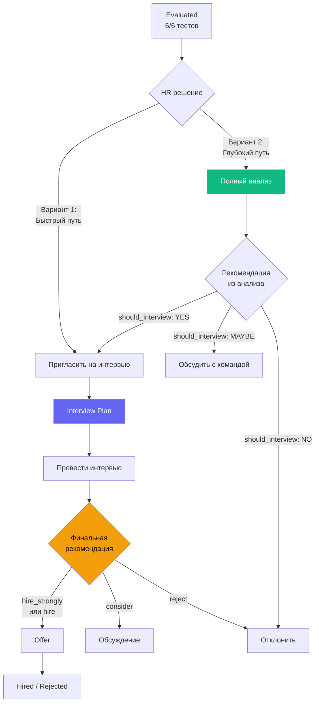

# Исследование проблемы "Полного AI-анализа" в текущем flow

**Дата:** 09.12.2025  
**Автор:** Architect Mode  
**Статус:** 🔬 Deep Analysis

---

## 🎯 СУТЬ ПРОБЛЕМЫ

> "Полный анализ был задуман как главная фишка платформы, но сейчас в воронке он выглядит лишним на фоне структурированного интервью"

---

## 📊 СРАВНИТЕЛЬНЫЙ АНАЛИЗ ФУНКЦИЙ

### Полный AI-анализ

**Файл:** `generate-full-analysis/index.ts`  
**Промпт:** 116 строк, 7 секций JSON  
**Стоимость:** ~4,000-8,000 токенов (Claude Haiku 4)  
**Время генерации:** 30-60 сек

#### Что генерирует:

```
1. PROFESSIONAL PROFILE
   ├── Summary (2-3 предложения)
   ├── Key strengths (массив)
   ├── Technical skills (массив)
   ├── Experience level (junior/middle/senior/lead)
   └── Unique value (что делает особенным)

2. PSYCHOLOGICAL PORTRAIT
   ├── Personality summary (3-4 предложения)
   ├── Big Five insights
   ├── MBTI analysis
   ├── DISC style
   ├── Emotional intelligence (EQ)
   └── Behavioral patterns (массив)

3. VACANCY COMPATIBILITY (для каждой вакансии)
   ├── Overall score (0-100)
   ├── Professional fit (0-100)
   ├── Cultural fit (0-100)
   ├── Motivation fit (0-100)
   ├── Detailed analysis (текст)
   ├── Recommendation (hire_strongly/hire/consider/reject)
   ├── Key matches (массив)
   └── Concerns (массив)

4. MOTIVATION ANALYSIS
   ├── Primary drivers (массив)
   ├── What motivates (текст)
   ├── What demotivates (текст)
   ├── Career aspirations (текст)
   └── Retention factors (массив)

5. POTENTIAL RISKS
   └── Для каждого риска:
       ├── Risk description
       ├── Severity (high/medium/low)
       └── Mitigation (как минимизировать)

6. COMMUNICATION GUIDE
   ├── Preferred style
   ├── Dos (массив)
   ├── Donts (массив)
   ├── Conflict resolution
   └── Feedback approach

7. FINAL ASSESSMENT
   ├── Overall score (0-100)
   ├── Hire recommendation (hire_strongly/hire/consider/reject)
   ├── Summary (2-3 предложения)
   ├── Best fit role
   ├── Growth potential
   └── Timeline recommendation (immediate/soon/consider_later/reject)
```

---

### Структурированное интервью

**Файл:** `generate-structured-interview/index.ts`  
**Промпт:** 176 строк, интерактивный JSON  
**Стоимость:** ~2,000-3,000 токенов (Claude 3.5 Sonnet)  
**Время генерации:** 30-45 сек

#### Что генерирует:

```
INTERACTIVE PLAN (5 секций):

1. INTRO (5 мин)
   └── Приветствие, ice breaker, установление контакта

2. EXPERIENCE (20 мин)
   └── 4+ вопроса:
       ├── STAR method (ситуация, задача, действие, результат)
       ├── What to listen for (что искать в ответе)
       ├── Red flags (признаки проблем)
       └── Rating enabled (оценка 1-5)

3. PSYCHOMETRIC (15 мин) ⚠️ КРИТИЧНО
   └── 2-3 проверки:
       ├── Risk check (например: высокий нейротизм)
       │   ├── Risk description (из теста)
       │   ├── Question (проверочный вопрос)
       │   ├── What to listen for
       │   └── Red flags
       └── Strength check (сильная сторона)
           ├── Strength description
           └── Question (как проявляется)

4. MOTIVATION (10 мин)
   └── 2+ вопроса:
       ├── Что мотивирует (основываясь на тесте Motivation)
       └── Культурный fit

5. CONCLUSION (5 мин)
   └── Вопросы кандидата, следующие шаги
```

**После проведения** (live заполнение HR):
```
SESSION DATA:
├── Notes (заметки по каждому пункту)
├── Ratings (оценки 1-5 по ключевым вопросам)
├── Completed items (чекбоксы)
└── Final completion:
    ├── Overall impression (текст, минимум 10 символов)
    └── Recommendation (hire_strongly/hire/consider/reject)
```

---

## 🔍 ВЫЯВЛЕННОЕ ДУБЛИРОВАНИЕ

### Высокий уровень дублирования (60-70%):

| Контент | Полный анализ | Структурированное интервью | % дублирования |
|---------|---------------|----------------------------|----------------|
| **Психометрия** | `psychological_portrait`: Big Five, MBTI, DISC, EQ инсайты (готовый текст) | `psychometric` секция: вопросы для проверки тех же тестов (интерактивная проверка) | 70% |
| **Риски** | `potential_risks`: список рисков + severity + митигация (готовый список) | `risk_check` items: вопросы для валидации рисков (проверка в live) | 80% |
| **Мотивация** | `motivation_analysis`: драйверы, что мотивирует/демотивирует (готовый текст) | `motivation` секция: вопросы про мотивацию (проверка устно) | 60% |
| **Рекомендация** | `final_assessment.hire_recommendation` (от AI) | `session_data.completion.recommendation` (от HR после интервью) | 100% конфликт |
| **Коммуникация** | `communication_guide`: dos/donts, feedback approach (теория) | Косвенно через "what_to_listen_for" в вопросах (практика) | 40% |

### Уникальный контент:

**Только в полном анализе:**
- ✅ `professional_profile` (краткое резюме для быстрого overview)
- ✅ `vacancy_compatibility` (scores по каждой вакансии - НЕТ в интервью)
- ✅ `retention_factors` (факторы удержания - важно!)
- ✅ `timeline_recommendation` (immediate/soon - НЕТ в интервью)

**Только в интервью:**
- ✅ `experience` секция (STAR вопросы по компетенциям)
- ✅ Интерактивность (чекбоксы, звезды, заметки)
- ✅ Live-инструмент для проведения беседы
- ✅ Автосохранение заметок HR

---

## 🧩 КОРНЕВАЯ ПРИЧИНА ПРОБЛЕМЫ

### Исторический анализ (из лога):

**Сессия 17 (15.11.2025):**
> "Начата работа по завершению пункта 5.3 ТЗ - Полный анализ кандидата"

**Изначальное видение (из ТЗ):**
```
"Полный AI-анализ кандидата"
- Профессиональный профиль - сильные стороны, навыки
- Психологический портрет - личностные особенности на основе тестов
- Соответствие вакансиям - детальное соответствие каждой вакансии с рекомендацией
- Мотивационные драйверы - что мотивирует кандидата
- Потенциальные риски - на что обратить внимание
- Рекомендации по взаимодействию - как лучше коммуницировать с кандидатом
- Итоговая оценка - финальная рекомендация (нанять/не нанять)
```

**Сессия 76 (08.12.2025):**
> "Модернизация модуля структурированного интервью"
> "Теперь использует детальные психометрические данные (все 6 тестов в JSON)"

**Что случилось:**
1. Полный анализ был спроектирован как **главный документ принятия решения**
2. Интервью изначально было "вопросами" (без глубокой психометрии)
3. В Сессии 76 интервью получило **ту же психометрию** что и анализ
4. Интервью стало давать **финальную рекомендацию** (конкурирующую с анализом)
5. Результат: **два AI-документа делают одно и то же**

### Диагноз:

**Feature Creep** - структурированное интервью "разрослось" и поглотило функции полного анализа.

---

## 💡 ВАРИАНТЫ РЕШЕНИЯ

### Вариант 1: УДАЛИТЬ полный анализ ❌

**Концепция:** Оставить только интервью как единственный AI-документ

**Логика:**
- `evaluated` → сразу "Пригласить на интервью" (без анализа)
- Интервью содержит всё: психометрию, риски, мотивацию, рекомендацию
- После интервью: решение о найме на основе protocol

**Плюсы:**
- ✅ Экономия ~5,000 токенов на кандидата
- ✅ Нет дублирования и противоречий
- ✅ Простой линейный flow
- ✅ Один источник правды (рекомендация из интервью)

**Минусы:**
- ❌ Потеря "главной фишки" платформы (это болезненно психологически)
- ❌ Нет быстрого overview для множественных вакансий (`vacancy_compatibility` для 5 вакансий сразу)
- ❌ Потеря детальных секций (retention_factors, timeline_recommendation)
- ❌ Нет "подготовительного материала" перед интервью

**Рекомендация:** ⚠️ Не рекомендуется - слишком радикально

---

### Вариант 2: ПЕРЕОПРЕДЕЛИТЬ роли (Split Responsibility) ⭐ РЕКОМЕНДУЕТСЯ

**Концепция:** Каждая функция для своего этапа принятия решения

#### 2.1 Полный анализ = "Pre-Interview Decision Brief"

**Новая цель:** Помочь HR решить - СТОИТ ЛИ вообще тратить время на интервью

**Когда генерируется:** Статус `evaluated` (кандидат завершил 6/6 тестов)

**Что меняем в промпте:**

```diff
- "final_assessment": {
-   "hire_recommendation": "hire_strongly|hire|consider|reject"
+ "interview_decision": {
+   "should_interview": "yes|maybe|no",
+   "confidence_level": "high|medium|low",
+   "reasoning": "Почему да или нет (2-3 предложения)",
+   "interview_focus_areas": ["Что проверить на интервью 1", "Область 2", "..."]
  }
```

**Новые акценты:**
- Фокус на `vacancy_compatibility` - оценки для КАЖДОЙ вакансии (это уникально!)
- `retention_factors` - долгосрочная ценность (критично!)
- `potential_risks` - что проверить на интервью
- `communication_guide` - как готовиться к беседе

**UI изменения:**
- Карточка итоговой оценки: вместо "Нанять/Отклонить" → "Пригласить на интервью: ДА ✅ / ВОЗМОЖНО 🤔 / НЕТ ❌"
- Добавить секцию "Focus Areas" - что проверить на интервью
- Убрать табы "Итоговая оценка" (она станет про интервью)

**Стоимость:** Без изменений (~4,000-8,000 токенов)

---

#### 2.2 Структурированное интервью = "Final Hiring Decision"

**Новая цель:** Единственный источник финальной рекомендации о найме

**Когда генерируется:** После решения HR "Да, приглашаем на интервью"

**Что меняем в промпте:**

```diff
+ ПРЕДВАРИТЕЛЬНЫЙ АНАЛИЗ (если есть):
+ {full_analysis_summary}
+ 
+ На основе анализа, обрати особое внимание на:
+ {focus_areas_from_analysis}

  ЗАДАЧА:
- Создай структурированный план интервью в формате JSON.
+ Создай план интервью, который валидирует выводы анализа и дает финальную рекомендацию о найме.
```

**Логика интеграции:**
1. Если ЕСТЬ полный анализ → интервью получает его как INPUT
2. Секция `psychometric` фокусируется на ВАЛИДАЦИИ рисков из анализа
3. После проведения: `recommendation` - это ФИНАЛЬНОЕ решение (единственное, что идет в воронку)

**UI изменения:**
- После завершения: badge "Рекомендация из интервью: Hire Strongly"
- В профиле кандидата: показывать оба документа (анализ = теория, интервью = практика)

---

### 2.3 Новый Flow в воронке



---

### 2.4 UI карточки в статусе EVALUATED (новый вид)

**Вариант 2А: Две равноценные кнопки**

```
┌─────────────────────────────────────────┐
│  👤 Иван Петров                    ⋮   │
│  Frontend Developer                     │
├─────────────────────────────────────────┤
│  ✅ 6/6 тестов                          │
├─────────────────────────────────────────┤
│  💡 Рекомендуем сначала провести        │
│     полный анализ (~4,000 токенов)      │
├─────────────────────────────────────────┤
│  [📊 Полный анализ]      ← outline      │
│  [📅 Пригласить сразу]   ← default      │
├─────────────────────────────────────────┤
│  Профиль · Чат                          │
└─────────────────────────────────────────┘
```

**Вариант 2Б: Анализ как главная (рекомендуемый)**

```
┌─────────────────────────────────────────┐
│  👤 Иван Петров                    ⋮   │
│  Frontend Developer                     │
├─────────────────────────────────────────┤
│  ✅ 6/6 тестов                          │
│  ⚠️ Анализ не проведен                  │
├─────────────────────────────────────────┤
│  [📊 Полный анализ]                     │
│  ↓ Рекомендуется перед интервью         │
│                                         │
│  [📅 Пригласить сразу]  ← ghost, small  │
├─────────────────────────────────────────┤
│  Профиль · Чат                          │
└─────────────────────────────────────────┘
```

**После генерации анализа:**

```
┌─────────────────────────────────────────┐
│  👤 Иван Петров                    ⋮   │
│  Frontend Developer                     │
├─────────────────────────────────────────┤
│  ✅ 6/6 тестов                          │
│  ✨ Анализ готов                        │
│  🎯 Рекомендация: Приглашать ДА         │
├─────────────────────────────────────────┤
│  [📄 Просмотреть анализ]  ← outline     │
│  [📅 Пригласить на интервью] ← emerald  │
├─────────────────────────────────────────┤
│  Профиль · Чат                          │
└─────────────────────────────────────────┘
```

---

### Преимущества Варианта 2:

✅ **Логичный двухэтапный процесс:**
1. Анализ → решение о целесообразности интервью (go/no-go)
2. Интервью → финальное решение о найме (hire/reject)

✅ **Нет противоречий:**
- Анализ: "Стоит ли приглашать?" (не "Нанять или нет?")
- Интервью: "Нанять или нет?" (финальное решение)

✅ **Уникальная ценность анализа сохраняется:**
- Быстрый overview по НЕСКОЛЬКИМ вакансиям сразу
- Retention factors (долгосрочная перспектива)
- Timeline (immediate/soon/consider_later)
- Подготовка к интервью (focus areas)

✅ **Гибкость для HR:**
- Можно пропустить анализ и сразу пригласить (быстрый путь)
- Можно сначала получить AI-рекомендацию (глубокий путь)

✅ **Экономия токенов (опционально):**
- Если анализ говорит "should_interview: NO" → не тратим токены на интервью
- Если сразу пригласили → не тратим на анализ

---

### Вариант 3: ОБЪЕДИНИТЬ в эволюционирующий документ ⚙️

**Концепция:** Один документ "Досье кандидата", который растет

**Этап 1 - Pre-Interview (evaluated):**
```json
{
  "stage": "analysis",
  "professional_profile": {...},
  "psychological_portrait": {...},
  "interview_decision": "yes/no",
  "focus_areas": ["Проверить 1", "Проверить 2"]
}
```

**Этап 2 - Interview Planning (interview - planned):**
```json
{
  "stage": "interview_planned",
  // Сохраняется все из этапа 1
  "interview_plan": {
    "sections": [...],
    "estimated_duration": 60
  }
}
```

**Этап 3 - Interview Complete (interview - completed):**
```json
{
  "stage": "interview_completed",
  // Сохраняется все из этапов 1-2
  "interview_results": {
    "notes": {...},
    "ratings": {...},
    "final_recommendation": "hire_strongly"
  }
}
```

**Преимущества:**
- ✅ Единый источник правды
- ✅ Полная история от анализа до решения
- ✅ Логическое развитие документа

**Минусы:**
- ❌ Сложная архитектура (версионность)
- ❌ Нужны изменения в БД (объединение таблиц)
- ❌ Сложно откатить

**Рекомендация:** ⚠️ Слишком сложно для текущей архитектуры

---

### Вариант 4: Анализ = ОПЦИОНАЛЬНЫЙ инструмент 🎯

**Концепция:** Анализ - это "премиум фича" для параноиков, не обязательное звено

**Логика воронки:**

```
EVALUATED (две кнопки):
├── [📊 Полный анализ] ← "Хочу детальное досье перед интервью" (optional)
└── [📅 Пригласить на интервью] ← "Сразу к делу" (always available)
```

**UI с контекстными подсказками:**

```tsx
// Вариант А: Анализ не проведен
<div className="space-y-2">
  <Button 
    variant="outline" 
    className="w-full gap-2"
    onClick={handleGenerateAnalysis}
  >
    <Bot className="h-4 w-4" />
    Полный анализ (рекомендуется)
  </Button>
  <p className="text-xs text-muted-foreground text-center">
    💡 Получите детальное досье и оценку для 
    каждой вакансии перед интервью
  </p>
  
  <Button 
    variant="ghost" 
    size="sm"
    className="w-full"
    onClick={handleInviteToInterview}
  >
    Пригласить без анализа →
  </Button>
</div>

// Вариант Б: Анализ проведен
<div className="space-y-2">
  <Badge variant="success">✨ Анализ готов</Badge>
  <p className="text-xs">
    Рекомендация: <strong>Приглашать ДА</strong>
  </p>
  
  <Button 
    variant="default"
    className="w-full bg-emerald-600"
    onClick={handleInviteToInterview}
  >
    <Calendar className="h-4 w-4 mr-2" />
    Пригласить на интервью
  </Button>
  
  <Button 
    variant="outline"
    size="sm"
    className="w-full"
    onClick={openAnalysisOverlay}
  >
    Просмотреть анализ
  </Button>
</div>
```

**Преимущества:**
- ✅ Гибкость: HR сам выбирает глубину проверки
- ✅ Экономия для "очевидных" кандидатов
- ✅ Анализ остается как "премиум" (сохраняется фишка)
- ✅ Нет конфликта рекомендаций (анализ = advisory, интервью = final)

**Минусы:**
- ⚠️ Риск что анализ будут всегда пропускать (зачем платить?)

**Как сделать анализ ценным:**
1. Добавить в UI: "92% HR генерируют анализ" (социальное доказательство)
2. После 3 интервью без анализа: toast "Попробуйте анализ - экономия времени на интервью!"
3. В настройках организации: "Обязательный анализ перед интервью" (checkbox)

---

### Вариант 5: ГИБРИДНЫЙ - Анализ встроен в интервью 🔄

**Концепция:** Интервью автоматически подтягивает анализ, если он есть

**Логика:**

```typescript
// При генерации interview:
const handleGenerateInterview = async () => {
  // 1. Проверяем наличие анализа
  const existingAnalysis = await getFullAnalysis(candidateId, organizationId)
  
  // 2. Если НЕТ анализа - предлагаем сгенерировать
  if (!existingAnalysis) {
    const shouldGenerate = await showDialog({
      title: "Рекомендуем сначала провести анализ",
      description: "Это даст более точный план интервью",
      actions: [
        { label: "Сгенерировать анализ (~4,000 токенов)", value: true },
        { label: "Пропустить", value: false }
      ]
    })
    
    if (shouldGenerate) {
      existingAnalysis = await generateFullAnalysis(...)
    }
  }
  
  // 3. Генерируем интервью (с анализом или без)
  const interview = await generateInterviewPlan({
    ...params,
    full_analysis: existingAnalysis || null // Передаем в промпт
  })
}
```

**Изменения в промпте интервью:**

```diff
+ {Если доступен полный анализ}
+ ПРЕДВАРИТЕЛЬНЫЙ АНАЛИЗ КАНДИДАТА:
+ - Психологический портрет: {psychological_portrait.summary}
+ - Выявленные риски: {potential_risks}
+ - Рекомендованные focus areas: {interview_focus_areas}
+ 
+ ЗАДАЧА: Создай план интервью, который ВАЛИДИРУЕТ выводы анализа.
+ - В секции "psychometric" сфокусируйся на проверке указанных рисков
+ - Добавь вопросы для подтверждения/опровержения инсайтов анализа
+ {/Если доступен}
```

**Преимущества:**
- ✅ Плавная интеграция (не нужно перестраивать flow)
- ✅ Анализ усиливает интервью (более точные вопросы)
- ✅ Гибкость (можно пропустить анализ)

**Минусы:**
- ⚠️ Усложнение промпта интервью
- ⚠️ Нужно обновлять Edge Function

---

## 🎯 МОЯ ФИНАЛЬНАЯ РЕКОМЕНДАЦИЯ

### Комбинация Вариант 2 + Вариант 5 (Best of Both Worlds)

#### Архитектура:

**1. Полный анализ = Pre-Interview Brief (опциональный)**
- Генерируется для глубокого понимания кандидата
- Дает рекомендацию: стоит ли интервью (`should_interview: yes/maybe/no`)
- Выявляет `focus_areas` - что проверить на интервью
- Оценивает совместимость с НЕСКОЛЬКИМИ вакансиями сразу
- Анализирует retention factors и долгосрочный потенциал

**2. Структурированное интервью = Final Decision (обязательный)**
- Автоматически использует анализ (если есть) для более точных вопросов
- Если анализа НЕТ - генерирует стандартные вопросы
- Дает ФИНАЛЬНУЮ рекомендацию о найме
- Это единственная рекомендация, которая идет в воронку

#### Flow в воронке:

```
EVALUATED:
├── Если НЕТ анализа:
│   ├── Кнопка 1 (recommended): "📊 Полный анализ" (emerald outline)
│   │   └── Подсказка: "Получите детальное досье для принятия решения"
│   └── Кнопка 2 (alternative): "📅 Пригласить сразу" (ghost, меньше)
│
└── Если ЕСТЬ анализ:
    ├── Badge: "✨ Анализ: Приглашать ДА" (зеленый)
    ├── Кнопка 1: "📅 Пригласить на интервью" (emerald, big)
    └── Кнопка 2: "Просмотреть анализ" (ghost, small)
```

#### Пример реального сценария:

**Кейс А: Очевидный кандидат (быстрый путь)**
```
HR: "Вижу 6/6 тестов, опыт подходящий, навыки есть"
HR: Клик "Пригласить сразу" → Interview (без анализа)
Интервью: Стандартные вопросы по психометрии
HR: Проводит, выставляет "hire" → Offer
Токены: 2,500 (только интервью)
```

**Кейс Б: Неоднозначный кандидат (глубокий путь)**
```
HR: "Тесты пройдены, но не уверен - подходит ли?"
HR: Клик "Полный анализ" → Ждет 30 сек
AI: "Анализ готов. Рекомендация: Приглашать ДА (88% совместимость)"
HR: "Отлично, вижу что риск низкий" → Клик "Пригласить"
Интервью: Персонализированные вопросы (использует риски из анализа)
HR: Проводит, подтверждает → "hire_strongly" → Offer
Токены: 7,000 (анализ + интервью)
```

**Кейс В: Множественные вакансии**
```
HR: "У нас 3 открытые вакансии, куда лучше?"
HR: Клик "Полный анализ" (передаем все 3 vacancy_ids)
AI: Показывает scores для каждой:
    - Frontend Lead: 95% ⭐ hire_strongly
    - Backend Middle: 78% → consider
    - DevOps: 65% → reject
HR: "Ясно! Приглашаем на Frontend Lead" → Interview
Токены: 6,500
```

#### Изменения в коде:

**Миграция промпта** (`0083_refactor_full_analysis_purpose.sql`):
```sql
-- Меняем final_assessment на interview_decision
UPDATE ai_prompts SET prompt_text = '
...
"interview_decision": {
  "should_interview": "yes|maybe|no",
  "confidence_level": "high|medium|low",
  "reasoning": "Обоснование решения",
  "interview_focus_areas": ["Что проверить на интервью"],
  "estimated_interview_duration": 45
}
...' 
WHERE operation_type = 'full_analysis';
```

**Edge Function `generate-structured-interview`**:
```typescript
// Загружаем анализ если есть
const { data: existingAnalysis } = await supabaseAdmin
  .from('candidate_full_analysis')
  .select('analysis_data')
  .eq('candidate_id', payload.candidate_id)
  .eq('organization_id', payload.organization_id)
  .maybeSingle()

// Добавляем в промпт
let analysisContext = ''
if (existingAnalysis?.analysis_data) {
  const data = existingAnalysis.analysis_data
  analysisContext = `
ПРЕДВАРИТЕЛЬНЫЙ АНАЛИЗ ДОСТУПЕН:
- Выявленные риски: ${JSON.stringify(data.potential_risks)}
- Рекомендованные focus areas: ${data.interview_decision.interview_focus_areas.join(', ')}

ЗАДАЧА: Создай план интервью с акцентом на ВАЛИДАЦИЮ этих рисков.
`
}

const finalPrompt = basePrompt + analysisContext
```

**UI `CandidateCard.tsx`**:
```tsx
// В статусе evaluated
if (application.status === 'evaluated') {
  if (!application.has_full_analysis) {
    actions.push(
      <div className="space-y-2">
        <Button 
          variant="outline"
          className="w-full gap-2 border-emerald-600 text-emerald-600"
          onClick={() => onGenerateAnalysis(application.id)}
        >
          <Bot className="h-4 w-4" />
          {t('actions.generateAnalysis')}
        </Button>
        <p className="text-[10px] text-muted-foreground text-center">
          💡 Рекомендуется для принятия решения
        </p>
        <Button
          variant="ghost"
          size="sm"
          className="w-full text-xs"
          onClick={() => onInviteToInterview(application.id)}
        >
          {t('actions.skipAndInvite')} →
        </Button>
      </div>
    )
  } else {
    // Анализ есть - показываем результат
    const decision = getAnalysisDecision(application.id) // Новый хук
    
    actions.push(
      <div className="space-y-2">
        <Badge variant="success" className="w-full">
          ✨ {decision.should_interview === 'yes' ? 'Приглашать ДА' : decision.should_interview === 'no' ? 'Не рекомендуется' : 'Возможно'}
        </Badge>
        <Button
          variant="default"
          className="w-full gap-2 bg-emerald-600"
          onClick={() => onInviteToInterview(application.id)}
        >
          <Calendar className="h-4 w-4" />
          {t('actions.inviteToInterview')}
        </Button>
        <Button
          variant="ghost"
          size="sm"
          className="w-full text-xs"
          onClick={openAnalysisOverlay}
        >
          Просмотреть анализ
        </Button>
      </div>
    )
  }
}
```

---

## 📈 ЭКОНОМИЧЕСКИЙ АНАЛИЗ

### Стоимость токенов по вариантам:

**Вариант 1 (Удалить анализ):**
- 1 кандидат: 2,500 токенов (только интервью)
- 100 кандидатов: 250,000 токенов
- Экономия: -500,000 токенов vs текущий подход

**Вариант 2 (Split Responsibility - оба всегда):**
- 1 кандидат: 7,000 токенов (анализ + интервью)
- 100 кандидатов: 700,000 токенов
- НО: 30% кандидатов отсеиваются после анализа → экономия на интервью
- Реально: 550,000 токенов (анализ для всех + интервью для 70%)

**Вариант 4 (Опциональный анализ):**
- HR генерят анализ для 50% кандидатов (сложные/неоднозначные)
- 1 кандидат: средний 4,750 токенов
- 100 кандидатов: 475,000 токенов
- Экономия + гибкость

---

## ✅ ФИНАЛЬНАЯ РЕКОМЕНДАЦИЯ

### Выбираю: **Вариант 2 + Вариант 5 (Split Responsibility + Hybrid)**

#### Что делаем:

**1. Переопределяем цель "Полного анализа":**
- ❌ Убираем: `hire_recommendation` (конкурирует с интервью)
- ✅ Добавляем: `interview_decision` (should_interview: yes/maybe/no)
- ✅ Добавляем: `interview_focus_areas` (что проверить на интервью)
- ✅ Сохраняем уникальную ценность:
  - Оценка по НЕСКОЛЬКИМ вакансиям (`vacancy_compatibility` array)
  - Retention factors (долгосрочная перспектива)
  - Timeline recommendation (immediate/soon)
  - Communication guide (подготовка к беседе)

**2. Интервью использует анализ (если есть):**
- Если анализ есть → промпт получает `focus_areas` и `risks`
- Секция `psychometric` фокусируется на валидации этих рисков
- Если анализа нет → стандартные психометрические вопросы

**3. UI воронки (статус evaluated):**

```
БЕЗ анализа:
├── Badge: "⚠️ Анализ не проведен"
├── [📊 Полный анализ] (emerald outline) ← recommended
│   └── Подсказка: "Получите оценку для каждой вакансии"
└── [📅 Пригласить сразу] (ghost, small) ← alternative

С анализом:
├── Badge: "✨ Рекомендация: Приглашать ДА" (если yes)
├── Badge: "🤔 Требует обсуждения" (если maybe)  
├── Badge: "❌ Не рекомендуется" (если no)
├── [📅 Пригласить на интервью] (emerald, big) ← если yes/maybe
└── [📄 Просмотреть анализ] (ghost, small)
```

#### Преимущества решения:

✅ **Нет дублирования ролей:**
- Анализ: "Стоит ли интервью?" + подготовка
- Интервью: "Нанять или нет?" + валидация

✅ **Синергия:**
- Анализ делает интервью точнее (персонализированные вопросы)
- Интервью валидирует анализ (теория → практика)

✅ **Уникальная ценность анализа сохранена:**
- Оценка множественных вакансий (интервью так не умеет)
- Retention factors
- Timeline recommendation

✅ **Гибкость для HR:**
- Можно пропустить анализ (быстрый путь)
- Можно использовать (глубокий путь)

✅ **Нет конфликтов:**
- Анализ: advisory decision (yes/no для интервью)
- Интервью: final decision (hire/reject)

---

## 🛠️ ПЛАН РЕАЛИЗАЦИИ

### Этап 1: Рефакторинг промпта анализа (1 час)

**Миграция:** `0083_refactor_full_analysis_purpose.sql`

```sql
-- Обновить структуру JSON в промпте
UPDATE ai_prompts SET prompt_text = '
...
  "interview_decision": {
    "should_interview": "yes|maybe|no",
    "confidence_level": "high|medium|low", 
    "reasoning": "Обоснование (2-3 предложения)",
    "interview_focus_areas": [
      "Проверить риск: высокий нейротизм",
      "Валидировать мотивацию к автономной работе",
      "Уточнить опыт с конкретной технологией"
    ],
    "estimated_interview_duration": 45,
    "alternative_vacancies": [
      {
        "title": "Backend Developer",
        "score": 78,
        "reasoning": "Навыки подходят, но меньше опыта"
      }
    ]
  }
...

УДАЛИТЬ старый блок:
  "final_assessment": {
    "hire_recommendation": ... ❌
  }
' WHERE operation_type = 'full_analysis';
```

### Этап 2: Обновить типы TypeScript (30 мин)

**Файл:** `src/features/ai-analysis/types.ts`

```typescript
export interface InterviewDecision {
  should_interview: 'yes' | 'maybe' | 'no'
  confidence_level: 'high' | 'medium' | 'low'
  reasoning: string
  interview_focus_areas: string[]
  estimated_interview_duration: number
  alternative_vacancies?: Array<{
    title: string
    score: number
    reasoning: string
  }>
}

export interface FullAnalysisData {
  professional_profile: ProfessionalProfile
  psychological_portrait: PsychologicalPortrait
  vacancy_compatibility: VacancyCompatibility[]
  motivation_analysis: MotivationAnalysis
  potential_risks: PotentialRisk[]
  communication_guide: CommunicationGuide
  interview_decision: InterviewDecision // ← CHANGED
}
```

### Этап 3: Обновить UI анализа (1 час)

**Файл:** `FullAnalysisView.tsx`

- Заменить карточку `Final Assessment` на `Interview Decision`
- Добавить секцию `Focus Areas` (список для подготовки)
- Добавить `Alternative Vacancies` если есть
- Убрать "hire/reject" бейджи, заменить на "yes/no для интервью"

### Этап 4: Интеграция в интервью (1.5 часа)

**Файл:** `generate-structured-interview/index.ts`

```typescript
// Загружаем анализ
const { data: existingAnalysis } = await supabaseAdmin
  .from('candidate_full_analysis')
  .select('analysis_data')
  .eq('candidate_id', payload.candidate_id)
  .eq('organization_id', payload.organization_id)
  .maybeSingle()

// Добавляем в промпт
let enrichedPrompt = basePrompt
if (existingAnalysis?.analysis_data) {
  const analysis = existingAnalysis.analysis_data
  enrichedPrompt += `

ДОСТУПЕН ПРЕДВАРИТЕЛЬНЫЙ АНАЛИЗ:

Выявленные риски:
${analysis.potential_risks.map(r => `- ${r.risk} (severity: ${r.severity})`).join('\n')}

Focus areas для проверки:
${analysis.interview_decision.interview_focus_areas.join('\n')}

КРИТИЧНО: В секции "psychometric" создай вопросы для ВАЛИДАЦИИ этих рисков.
`
}
```

### Этап 5: Обновить UI воронки (1 час)

**Файл:** `CandidateCard.tsx`

- Добавить badge с результатом `interview_decision`
- Логика кнопок по варианту 2Б (см. выше)
- Добавить tooltip с подсказками

### Этап 6: Локализация (30 мин)

Добавить ключи:
- `actions.skipAndInvite` - "Пригласить без анализа"
- `badges.analysisRecommends` - "Анализ: Приглашать {decision}"
- `badges.analysisComplete` - "Анализ готов"

**Итого: 5.5 часов**

---

## 🎬 НОВЫЙ USER FLOW (С АНАЛИЗОМ)

```
1. Кандидат завершает 6/6 тестов → [evaluated]
   Badge: "✅ 6/6 тестов" + "⚠️ Анализ не проведен"

2. HR видит кнопку "📊 Полный анализ" (emerald, recommended)
   Подсказка: "Получите оценку для каждой вакансии перед интервью"

3. HR кликает → AIGenerationModal (30 сек)
   Toast: "Анализ готов!" 

4. Badge меняется: "✨ Рекомендация: Приглашать ДА"
   Кнопка: "📅 Пригласить на интервью" (emerald, big)

5. HR кликает "Пригласить" → AIGenerationModal (30 сек)
   Генерируется интервью С УЧЕТОМ рисков из анализа

6. Статус меняется: [interview]
   Badge: "📅 Интервью запланировано"
   Кнопка: "📝 Провести интервью"

7. HR проводит интервью (чекбоксы, оценки, заметки)
   Видит focus areas из анализа в начале каждой секции

8. HR завершает → recommendation: "hire_strongly"
   Badge меняется: "✨ Нанять немедленно!" (пульсация)

9. Кнопка: "💼 К офферу" → [offer] → [hired] 🎉
```

**Итого: 6 кликов + 2 AI-генерации**  
**Токены: ~7,000**  
**Время: ~5-7 минут активной работы + 1 час интервью**

---

## 💎 КЛЮЧЕВЫЕ ИНСАЙТЫ

### 1. Полный анализ НУЖЕН, но с другой целью

**Было:** "Финальная рекомендация о найме" (конкурирует с интервью)  
**Должно быть:** "Рекомендация о целесообразности интервью" (готовит к интервью)

### 2. Уникальная ценность анализа

**Что ТОЛЬКО анализ умеет:**
- Оценивать НЕСКОЛЬКО вакансий одновременно (интервью - одна вакансия)
- Retention factors (долгосрочная перспектива)
- Timeline recommendation (когда нанимать)
- Communication guide (как готовиться к беседе)

**Это делает анализ незаменимым для:**
- Кандидатов на множественные роли
- Оценки долгосрочного потенциала
- Подготовки к сложным интервью

### 3. Интеграция усиливает обе функции

**Анализ → Интервью:**
- Риски из анализа становятся вопросами в интервью
- Focus areas направляют беседу
- HR приходит на интервью подготовленным

**Интервью → Решение:**
- Финальная рекомендация основана на live-проверке анализа
- Заметки HR дополняют теоретический анализ
- Комбинация AI (анализ) + Human (интервью) = лучшее решение

---

## 🚦 РЕКОМЕНДАЦИЯ К ДЕЙСТВИЮ

### Что делать СЕЙЧАС:

✅ **Принять Вариант 2 + Вариант 5** (Split + Hybrid)

### Почему это лучшее решение:

1. ✅ Сохраняет уникальную ценность обеих функций
2. ✅ Устраняет конфликт рекомендаций
3. ✅ Создает логичный двухэтапный процесс
4. ✅ Дает гибкость (можно пропустить анализ)
5. ✅ Интеграция через общий контекст (анализ → интервью)
6. ✅ Реализация простая (5.5 часов)

### Следующий шаг:

Если согласен с этим решением → переключаемся в **Code mode** для реализации:
1. Миграция промпта (30 мин)
2. Обновление типов (30 мин)
3. Рефакторинг UI анализа (1 час)
4. Интеграция в интервью (1.5 часа)
5. Обновление воронки (1 час)
6. Локализация (30 мин)

**Итого: 5.5 часов чистой разработки**

---

## 🤔 АЛЬТЕРНАТИВНЫЙ ВАРИАНТ (если не согласен)

Если считаешь что анализ все равно избыточен → можем обсудить:
- Вариант 1 (удалить) - радикально, но экономит токены
- Вариант 4 (опциональный) - middle ground с настройкой "Обязательный анализ"

**Что нужно от тебя:**
1. Выбрать вариант (2+5, 1, или 4)
2. Подтвердить изменения в промпте
3. Дать go/no-go на реализацию

---

## 📋 ЧЕКЛИСТ ИЗМЕНЕНИЙ (Вариант 2+5)

- [ ] Миграция `0083_refactor_full_analysis_purpose.sql`
- [ ] Обновить `types.ts` (InterviewDecision)
- [ ] Обновить `FullAnalysisView.tsx` (новая карточка)
- [ ] Обновить `generate-structured-interview` (интеграция анализа)
- [ ] Обновить `CandidateCard.tsx` (логика кнопок)
- [ ] Добавить хук `useGetAnalysisDecision`
- [ ] Локализация (ru/en/kk)
- [ ] Тестирование flow

**Готово к обсуждению!** 🚀