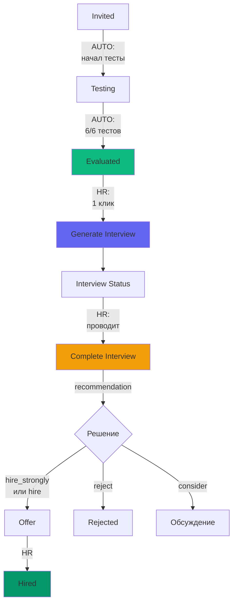

# План удаления модуля "Полный AI-анализ"

**Дата:** 09.12.2025  
**Решение:** Удалить полный анализ, усилить интервью и сравнение  
**Статус:** 📋 Planning

---

## 🎯 ОБОСНОВАНИЕ РЕШЕНИЯ

### Почему удаляем:

1. ❌ **Дублирование 70%** - та же психометрия что в интервью
2. ❌ **Конфликт рекомендаций** - две функции говорят "нанять/не нанять"
3. ❌ **Нет практической пользы** - HR все равно проводит интервью
4. ❌ **Лишний шаг** - усложняет flow без добавления ценности
5. ❌ **Стоимость** - 4,000-8,000 токенов на каждого кандидата

### Что делаем вместо:

✅ **Усиливаем интервью** - становится единственным AI-документом принятия решения  
✅ **Усиливаем сравнение** - добавляем retention factors, timeline  
✅ **Упрощаем flow** - `evaluated` → сразу `interview`

---

## 🗑️ ЧТО УДАЛЯТЬ

### 1. Edge Function

**Файл:** `supabase/functions/generate-full-analysis/index.ts` (493 строки)

**Действие:** 
- ❌ Удалить весь файл
- ❌ Удалить из деплоя (если есть в `config.toml`)

**Важно:** Проверить что никакие другие функции не импортируют из неё код

---

### 2. Frontend API

**Файлы к удалению:**
- `src/features/ai-analysis/api/generateFullAnalysis.ts`
- `src/features/ai-analysis/api/getFullAnalysisByCandidate.ts`
- `src/features/ai-analysis/api/getAllAnalysesByCandidate.ts`

**Действие:** Удалить файлы

---

### 3. Frontend UI компоненты

**Файлы к удалению:**
- `src/features/ai-analysis/ui/GenerateFullAnalysisDialog.tsx`
- `src/features/ai-analysis/ui/FullAnalysisView.tsx`
- `src/features/ai-analysis/ui/FullAnalysisHistory.tsx`
- `src/features/ai-analysis/ui/pdf/FullAnalysisDocument.tsx` (если есть)

**Действие:** Удалить файлы

---

### 4. Интеграция в воронке

**Файл:** `src/features/vacancy-management/ui/funnel/VacancyFunnel.tsx`

**Что удаляем:**
```typescript
// States
const [isGeneratingAnalysis, setIsGeneratingAnalysis] = useState(false)
const [viewingAnalysisId, setViewingAnalysisId] = useState<string | null>(null)
const [analysisDialogState, setAnalysisDialogState] = useState({...})

// Mutations
const generateAnalysisMutation = useGenerateFullAnalysis()

// Handlers
const handleGenerateAnalysis = (applicationId: string) => {...}
const handleConfirmedAnalysisGeneration = async () => {...}

// Components
<GenerateFullAnalysisDialog ... />
<AIGenerationModal isOpen={isGeneratingAnalysis} ... />
<Dialog> {/* Analysis Overlay */} </Dialog>
<FullAnalysisViewWrapper analysisId={viewingAnalysisId} />
```

**Строки:** ~200 строк кода

---

### 5. Карточка кандидата

**Файл:** `src/features/vacancy-management/ui/funnel/CandidateCard.tsx`

**Что удаляем:**

```typescript
// В renderDynamicBadges():
// Убрать badges связанные с анализом (строки 106-122)
if ((application.status === 'evaluated' || application.status === 'interview') && !application.has_full_analysis) {
  badges.push(<Badge>Анализ не проведен</Badge>) // ❌ УДАЛИТЬ
}
if (application.has_full_analysis && ...) {
  badges.push(<Badge>Анализ готов</Badge>) // ❌ УДАЛИТЬ
}

// В renderContextActions():
// Убрать кнопку генерации анализа (строки 210-223)
if (application.status === 'evaluated') {
  if (!application.has_full_analysis) {
    actions.push(<Button>Полный анализ</Button>) // ❌ УДАЛИТЬ
  }
  // Оставить только:
  actions.push(<Button>Пригласить на интервью</Button>) // ✅ ОСТАВИТЬ
}
```

---

### 6. Страница профиля кандидата

**Файл:** `src/pages/hr/candidate/profile/index.tsx`

**Что удаляем:**
- Вкладку "Анализы" (полностью)
- Импорты: `FullAnalysisHistory`, `FullAnalysisView`
- State: `viewingAnalysisId`
- Queries: `useGetAllAnalysesByCandidate`

**Остается:**
- Вкладка "Документы" ✅
- Вкладка "Интервью" ✅
- Вкладка "Информация" ✅
- Кнопка "Написать сообщение" ✅

---

### 7. Публичная страница анализа

**Файл:** `src/pages/public/analysis/index.tsx`

**Действие:** ❌ Удалить файл  
**Роут:** Удалить из `router/index.tsx`

---

### 8. Типы TypeScript

**Файл:** `src/features/ai-analysis/types.ts`

**Что удаляем:**
```typescript
// Удалить интерфейсы (строки ~88-150):
export interface ProfessionalProfile {...}
export interface PsychologicalPortrait {...}
export interface VacancyCompatibility {...}
export interface MotivationAnalysis {...}
export interface PotentialRisk {...}
export interface CommunicationGuide {...}
export interface FinalAssessment {...}
export interface FullAnalysisData {...}
export interface FullAnalysisResult {...}
```

**Что оставляем:**
- Типы для анализа резюме ✅
- Типы для сравнения ✅
- Типы для документов ✅

---

### 9. Локализация

**Файлы:** `public/locales/{ru,en,kk}/ai-analysis.json`

**Что удаляем:**
- Секция `generateFullAnalysis` (строки ~30-50)
- Секция `fullAnalysis` (строки ~100-200)

**Что оставляем:**
- `resumeAnalysis` ✅
- `compareCandidates` ✅
- `generateDocument` ✅
- `generateInterview` ✅

---

## ✅ ЧТО СОХРАНЯЕМ (Важно!)

### База данных - НЕ ТРОГАЕМ

**Таблица:** `candidate_full_analysis`

**Причина сохранения:**
1. Исторические данные - уже есть анализы в продакшене
2. Возможность восстановить функцию в будущем
3. Админы могут просматривать старые анализы через Supabase Dashboard

**Что делаем:**
- Таблица остается как есть (с данными)
- RLS политики остаются
- НО новые записи создаваться не будут

**Опциональная миграция (в будущем):**
```sql
-- Если захотим полностью убрать через N месяцев:
-- 0084_archive_full_analysis.sql
ALTER TABLE candidate_full_analysis RENAME TO candidate_full_analysis_archived;
COMMENT ON TABLE candidate_full_analysis_archived IS 'Archived: feature removed 2025-12-09';
```

---

### Промпт в ai_prompts - ДЕАКТИВИРУЕМ

**Действие:**
```sql
-- Миграция 0083_deactivate_full_analysis.sql
UPDATE ai_prompts 
SET is_active = false
WHERE operation_type = 'full_analysis';

UPDATE ai_models
SET is_active = false
WHERE operation_type = 'full_analysis';

COMMENT ON TABLE candidate_full_analysis IS 'Feature deprecated 2025-12-09: Full analysis removed from flow, replaced by structured interview';
```

---

### Просмотр старых анализов - СОХРАНЯЕМ

**Зачем:**
- Уже сгенерированные анализы могут быть полезны
- Это уже потраченные токены - не выбрасываем результат

**Как:**
- В профиле кандидата: IF есть старые анализы → показываем вкладку "История анализов (архив)"
- Badge: "📦 Архив" рядом с названием вкладки
- Tooltip: "Функция удалена из платформы, но старые анализы доступны"

---

## 🚀 ЧЕМ УСИЛИВАЕМ ОСТАВШИЕСЯ ФУНКЦИИ

### 1. Структурированное интервью → ГЛАВНЫЙ инструмент

**Что добавляем:**

#### A. Retention Factors (из удаленного анализа)

**Новая секция в промпте интервью:**
```json
{
  "id": "retention",
  "title": "Факторы удержания и долгосрочная перспектива",
  "time_allocation": 5,
  "description": "Оценка долгосрочного потенциала",
  "items": [
    {
      "type": "question",
      "category": "retention",
      "question": "Что для вас важно в компании долгосрочно?",
      "what_to_listen_for": "Соответствие ценностям организации",
      "retention_factors": ["Фактор 1", "Фактор 2"] // AI-генерация
    }
  ]
}
```

#### B. Timeline Recommendation

**После завершения интервью:**
```typescript
completion: {
  overall_impression: "...",
  recommendation: "hire_strongly",
  timeline: "immediate" | "soon" | "consider_later", // НОВОЕ
  retention_score: 85 // 0-100, НОВОЕ
}
```

#### C. Умная оценка по секциям

**Добавить итоговую таблицу в протокол:**
```
┌─────────────────────────────────────┐
│ ИТОГОВЫЕ ОЦЕНКИ                     │
├─────────────────────────────────────┤
│ Профессиональные навыки:  4.5/5 ⭐  │
│ Психометрия (риски):      4.0/5 ⭐  │
│ Мотивация и культура:     4.8/5 ⭐  │
│ Долгосрочный потенциал:   4.2/5 ⭐  │
├─────────────────────────────────────┤
│ ОБЩАЯ ОЦЕНКА:            4.4/5 ⭐   │
└─────────────────────────────────────┘
```

**Это будет автоматически рассчитываться из ratings по вопросам**

---

### 2. Сравнение кандидатов → БОЛЕЕ детальное

**Что добавляем в промпт:**

#### A. Retention Analysis

```json
"retention_analysis": {
  "candidate_1_retention_score": 85,
  "candidate_2_retention_score": 72,
  "retention_factors_comparison": "Иван показывает высокую мотивацию к долгосрочному росту...",
  "turnover_risk": {
    "candidate_1": "low",
    "candidate_2": "medium"
  }
}
```

#### B. Timeline Recommendation

```json
"timeline": {
  "immediate_hire_candidates": ["uuid1"],
  "hire_soon_candidates": ["uuid2"],
  "consider_later_candidates": [],
  "reasoning": "Иван готов немедленно, Петр нуждается в onboarding"
}
```

#### C. Team Fit Analysis

```json
"team_dynamics": {
  "best_fit_for_team": "uuid1",
  "reasoning": "На основе DISC и Big Five, Иван дополнит текущий состав...",
  "potential_conflicts": ["Петр может конфликтовать с текущим лидом"]
}
```

---

## 📋 ДЕТАЛЬНЫЙ ЧЕКЛИСТ УДАЛЕНИЯ

### Backend (Supabase)

- [ ] Создать миграцию `0083_deactivate_full_analysis.sql`:
  - [ ] `UPDATE ai_prompts SET is_active = false WHERE operation_type = 'full_analysis'`
  - [ ] `UPDATE ai_models SET is_active = false WHERE operation_type = 'full_analysis'`
  - [ ] Добавить COMMENT на таблицу (объяснение)
  - [ ] ⚠️ НЕ удаляем таблицу `candidate_full_analysis` (сохраняем историю)

- [ ] Обновить промпт интервью (`0084_enhance_interview_prompt.sql`):
  - [ ] Добавить секцию "retention" (5 мин)
  - [ ] Добавить в completion: `timeline`, `retention_score`
  - [ ] Увеличить `estimated_duration` с 60 до 70 минут

- [ ] Обновить промпт сравнения (`0085_enhance_comparison_prompt.sql`):
  - [ ] Добавить `retention_analysis`
  - [ ] Добавить `timeline` рекомендацию
  - [ ] Добавить `team_dynamics`

### Frontend - Удаление (15 файлов)

**API (3 файла):**
- [ ] `src/features/ai-analysis/api/generateFullAnalysis.ts`
- [ ] `src/features/ai-analysis/api/getFullAnalysisByCandidate.ts`
- [ ] `src/features/ai-analysis/api/getAllAnalysesByCandidate.ts`

**UI компоненты (4 файла):**
- [ ] `src/features/ai-analysis/ui/GenerateFullAnalysisDialog.tsx`
- [ ] `src/features/ai-analysis/ui/FullAnalysisView.tsx`
- [ ] `src/features/ai-analysis/ui/FullAnalysisHistory.tsx`
- [ ] `src/features/ai-analysis/ui/pdf/FullAnalysisDocument.tsx` (если существует)

**Интеграция (2 файла):**
- [ ] `src/features/vacancy-management/ui/funnel/VacancyFunnel.tsx`:
  - [ ] Удалить state `isGeneratingAnalysis`, `viewingAnalysisId`, `analysisDialogState`
  - [ ] Удалить `generateAnalysisMutation`
  - [ ] Удалить handlers `handleGenerateAnalysis`, `handleConfirmedAnalysisGeneration`
  - [ ] Удалить `AIGenerationModal` для анализа
  - [ ] Удалить `FullAnalysisViewWrapper`
  - [ ] Убрать prop `onGenerateAnalysis` из `KanbanColumn`
  - [ ] **Итого:** -200 строк

- [ ] `src/features/vacancy-management/ui/funnel/CandidateCard.tsx`:
  - [ ] Убрать badges "Анализ не проведен" / "Анализ готов" (строки 106-122)
  - [ ] Убрать кнопку "Полный анализ" из actions (строки 210-223)
  - [ ] **Итого:** -30 строк

**Страница профиля:**
- [ ] `src/pages/hr/candidate/profile/index.tsx`:
  - [ ] Условно: IF есть старые анализы в БД → оставить вкладку "Архив анализов"
  - [ ] ELSE → полностью убрать вкладку
  - [ ] Убрать импорты компонентов анализа

**Публичная страница:**
- [ ] `src/pages/public/analysis/index.tsx` - удалить
- [ ] `src/app/router/index.tsx` - убрать роут `/public/analysis/:id`

**Типы:**
- [ ] `src/features/ai-analysis/types.ts`:
  - [ ] Удалить ~100 строк (все интерфейсы полного анализа)
  - [ ] Оставить типы для резюме, сравнения, документов

**Локализация (3 файла × 3 языка = 9 файлов):**
- [ ] `public/locales/ru/ai-analysis.json`:
  - [ ] Удалить секцию `generateFullAnalysis`
  - [ ] Удалить секцию `fullAnalysis`
- [ ] То же для `en` и `kk`

**Итого удаления:**
- Edge Function: -493 строки
- Frontend: ~1,200 строк
- Локализация: ~300 строк
- **ВСЕГО: ~2,000 строк кода**

---

### Frontend - Добавление (усиление функций)

**Интервью:**
- [ ] Обновить `InterviewWorkspace.tsx`:
  - [ ] Добавить итоговую карточку "Общая оценка" после завершения
  - [ ] Показывать рассчитанные scores по секциям

**Сравнение:**
- [ ] Обновить `ComparisonResultView.tsx`:
  - [ ] Добавить вкладку "Retention & Timeline"
  - [ ] Показывать retention scores
  - [ ] Показывать timeline для каждого кандидата

---

## 🔄 ОБНОВЛЕННЫЙ FLOW В ВОРОНКЕ

### До удаления (сейчас):
```
evaluated:
├── [📊 Полный анализ] ❌
└── [📅 Пригласить на интервью] ✅
```

### После удаления:
```
evaluated:
└── [📅 Пригласить на интервью] ✅ (единственная кнопка)
```

**Преимущества:**
- Простота - один очевидный следующий шаг
- Скорость - нет промежуточного этапа
- Экономия - сразу к интервью

---

## 💰 ЭКОНОМИЧЕСКИЙ ЭФФЕКТ

### Экономия токенов:

**До:**
- Анализ: 5,000 токенов
- Интервью: 2,500 токенов
- **Итого:** 7,500 токенов на кандидата

**После:**
- Интервью (улучшенное): 3,000 токенов
- **Итого:** 3,000 токенов на кандидата

**Экономия:** 60% (4,500 токенов на кандидата)

**При 1000 кандидатов в год:**
- Экономия: 4,500,000 токенов
- В деньгах: ~$225 (при $0.05 за 1k токенов)

---

## ⚠️ СОХРАНЕНИЕ ИСТОРИИ

### Для существующих анализов:

**Вариант A: Архивная вкладка (рекомендуется)**

```tsx
// В CandidateProfilePage
const { data: hasOldAnalyses } = useQuery({
  queryKey: ['has-analyses', candidateId],
  queryFn: async () => {
    const { count } = await supabase
      .from('candidate_full_analysis')
      .select('*', { count: 'exact', head: true })
      .eq('candidate_id', candidateId)
    return count > 0
  }
})

// Условный рендер вкладки
<TabsList>
  <TabsTrigger value="documents">Документы</TabsTrigger>
  <TabsTrigger value="interviews">Интервью</TabsTrigger>
  {hasOldAnalyses && (
    <TabsTrigger value="analyses-archive">
      Архив анализов 📦
    </TabsTrigger>
  )}
  <TabsTrigger value="info">Информация</TabsTrigger>
</TabsList>
```

**Tooltip на вкладке:**
> "Функция 'Полный анализ' удалена из платформы 09.12.2025, но старые анализы доступны для просмотра"

---

## 🎯 УСИЛЕНИЕ ИНТЕРВЬЮ

### Новые секции в промпте:

**Секция 6: Retention & Long-term Fit (5 мин)**

```json
{
  "id": "retention",
  "title": "Долгосрочная перспектива",
  "time_allocation": 5,
  "description": "Оценка факторов удержания",
  "items": [
    {
      "type": "question",
      "category": "retention",
      "question": "Что для вас важно в компании через 1-2 года?",
      "what_to_listen_for": "Соответствие ценностям, карьерные амбиции",
      "retention_factors_to_evaluate": [
        "Возможности роста",
        "Баланс работы и жизни",
        "Стабильность",
        "Автономность",
        "Команда"
      ],
      "rating_enabled": true
    },
    {
      "type": "question",
      "category": "retention",
      "question": "Что может заставить вас уйти из компании?",
      "what_to_listen_for": "Red flags для retention",
      "rating_enabled": true
    }
  ]
}
```

**В completion добавляем:**
```json
{
  "overall_impression": "...",
  "recommendation": "hire_strongly",
  "timeline": "immediate", // НОВОЕ
  "retention_score": 85, // НОВОЕ (0-100)
  "retention_factors": ["Growth", "Team", "Stability"], // НОВОЕ
  "key_retention_risks": ["May leave if no promotion in 1 year"] // НОВОЕ
}
```

---

### 2. Сравнение кандидатов → БОЛЕЕ практичное

**Новая секция в промпте:**

```json
"practical_recommendations": {
  "hire_order": ["uuid1", "uuid2", "uuid3"],
  "reasoning": "Иван - немедленно (готов), Петр - через месяц (нужен onboarding), Мария - резерв",
  "timeline_fit": {
    "immediate_need": "uuid1",
    "future_need": "uuid3"
  },
  "retention_analysis": {
    "highest_retention": "uuid1",
    "retention_scores": { "uuid1": 88, "uuid2": 75, "uuid3": 82 },
    "turnover_risks": {
      "uuid2": "medium - может уйти если нет четкого career path"
    }
  },
  "team_composition_advice": "Иван лучше fit как senior в текущую команду, Петр - как middle в будущую"
}
```

**UI изменения:**

Добавить 4-ю вкладку в `ComparisonResultView`:
- Рейтинг ✅ (есть)
- Сравнительная матрица ✅ (есть)
- Итоговая рекомендация ✅ (есть)
- **НОВАЯ:** Практические советы (timeline, retention, team fit)

---

## 🎬 НОВЫЙ УПРОЩЕННЫЙ FLOW



**Удалено:**
- ❌ Шаг "Полный анализ" между evaluated и interview
- ❌ Дублирующая рекомендация

**Результат:**
- ✅ Линейный flow (меньше решений для HR)
- ✅ Быстрее (один AI-документ вместо двух)
- ✅ Дешевле (экономия 60%)

---

## 🚦 ПЛАН ДЕЙСТВИЙ (5 часов)

### Этап 1: Backend (1.5 часа)
1. Миграция `0083_deactivate_full_analysis.sql`
2. Миграция `0084_enhance_interview_prompt.sql` (retention section)
3. Миграция `0085_enhance_comparison_prompt.sql` (retention + timeline)
4. Удалить Edge Function `generate-full-analysis`

### Этап 2: Frontend - Удаление (2 часа)
1. Удалить 11 файлов компонентов/API
2. Очистить `VacancyFunnel.tsx` (-200 строк)
3. Очистить `CandidateCard.tsx` (-30 строк)
4. Убрать вкладку из `CandidateProfilePage`
5. Удалить публичную страницу
6. Очистить типы

### Этап 3: Frontend - Усиление (1 час)
1. Обновить `InterviewWorkspace.tsx` (итоговая карточка с scores)
2. Обновить `ComparisonResultView.tsx` (4-я вкладка)

### Этап 4: Локализация (30 мин)
1. Удалить секции из `ai-analysis.json`
2. Добавить новые ключи для интервью (`retention`, `timeline`)
3. Обновить ключи для сравнения

### Этап 5: Тестирование (1 час)
1. Полный flow: evaluated → interview → hired
2. Проверить что старые анализы не ломают UI
3. Проверить усиленное интервью
4. Проверить усиленное сравнение

**ИТОГО: 6 часов**

---

## ✨ РЕЗУЛЬТАТ ПОСЛЕ РЕАЛИЗАЦИИ

### Упрощенная воронка:

```
EVALUATED (после 6/6 тестов):
└── [📅 Пригласить на интервью] ← единственная кнопка, очевидное действие

↓ (AI генерация 30 сек)

INTERVIEW (план готов):
├── Badge: "📅 Интервью запланировано"
└── [📝 Провести интервью] ← открывает workspace

↓ (HR заполняет: чекбоксы, оценки, заметки)

INTERVIEW (после завершения):
├── Badge: "✨ Нанять немедленно!" (пульсация)
├── Показывает:
│   ├── Overall score: 4.5/5 ⭐
│   ├── Retention score: 88%
│   └── Timeline: Immediate
└── [💼 К офферу] ← яркая кнопка

↓

OFFER → HIRED 🎉
```

**Клики HR:** 4 (было 6)  
**Токены:** 3,000 (было 7,000)  
**Время:** 3 минуты + 1 час интервью

---

## 🎓 УРОКИ ДЛЯ БУДУЩЕГО

### Что пошло не так:

1. **Feature Creep** - интервью "разрослось" и поглотило функции анализа
2. **Нет четкого разделения** - обе функции отвечали на вопрос "нанять?"
3. **Эмоциональная привязка** - "главная фишка" стала обузой

### Принципы для новых функций:

✅ Каждая функция должна отвечать на ОДИН вопрос  
✅ Нет дублирования целей между функциями  
✅ Новая функция = новая ценность (не усиление существующей)  
✅ "Kill your darlings" - если функция не нужна, удаляем без сожаления

---

## 📝 CHANGELOG ДЛЯ КОММИТА

```
feat: remove redundant "Full Analysis" feature

BREAKING CHANGE: Full candidate analysis removed from hiring flow

Reasons:
- 70% content duplication with structured interview
- Conflicting recommendations (analysis vs interview)
- No practical value - HR conducts interview anyway
- Cost: 4,000-8,000 tokens per candidate

Changes:
- Removed: Edge Function generate-full-analysis
- Removed: 11 frontend components and APIs
- Removed: ~2,000 lines of code
- Enhanced: Structured interview (retention section)
- Enhanced: Candidate comparison (retention + timeline)
- Preserved: Database table (for historical data)

Result:
- 60% token savings (7,500 → 3,000 per candidate)
- Simpler flow (evaluated → interview directly)
- No conflicting decisions

Migration: 0083, 0084, 0085
```

---

## ✅ ГОТОВО К РЕАЛИЗАЦИИ

**Следующий шаг:** Переключаемся в Code mode для удаления

**Приоритет:** High (архитектурное улучшение)

**Риски:** Low (удаление, не изменение логики)

🚀 **Ready to code!**