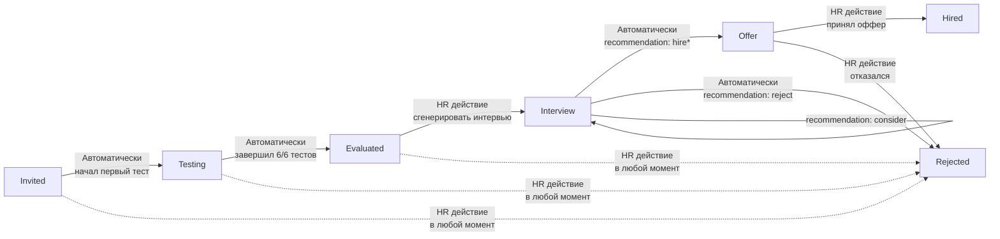
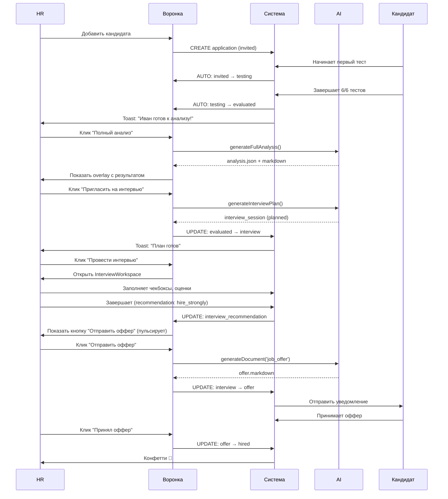
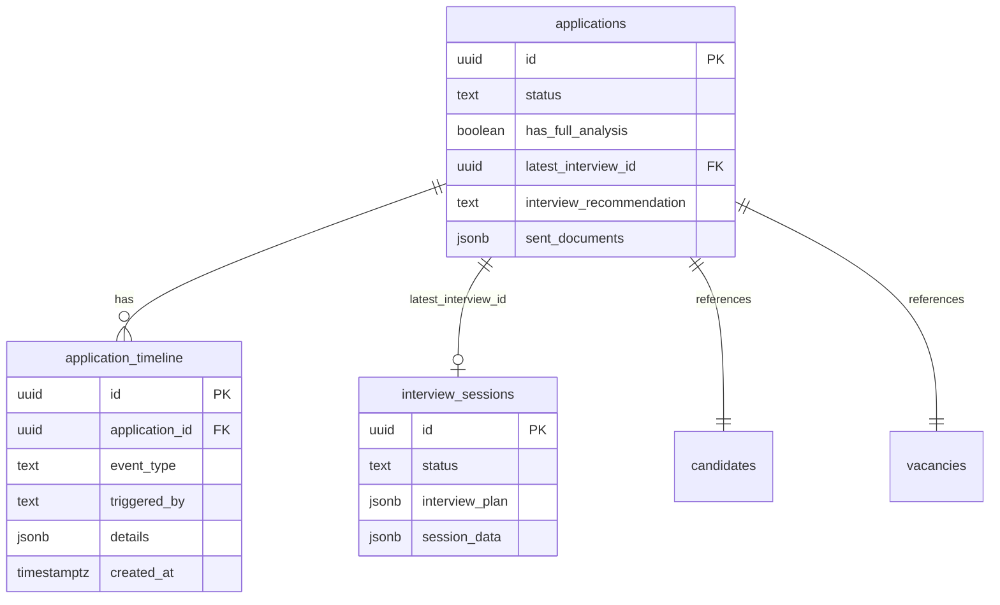

# Архитектура "Умной воронки" с AI-интеграцией

**Дата:** 09.12.2025  
**Версия:** 1.0  
**Статус:** 🎯 Design Phase

---

## 📊 ПРОБЛЕМА

### Текущее состояние:
- ❌ Все кандидаты застревают на статусе `invited`
- ❌ Нет автоматических переходов (testing → evaluated)
- ❌ AI-функции разрознены (анализ, сравнение, документы, интервью)
- ❌ Страница профиля кандидата перегружена кнопками генерации
- ❌ HR не видит прогресса кандидата в реальном времени
- ❌ Интервью с рекомендациями не связано с воронкой

### Пользовательские жалобы:
> "Воронка не работает - все на первом этапе"  
> "Генерация документов стоит особнячком"  
> "Не понятно, когда кандидат готов к следующему шагу"

---

## 🎯 РЕШЕНИЕ: "Умная воронка с AI-ассистентом"

### Концепция:
**Воронка становится центром управления процессом найма**, где:
1. Система автоматически двигает кандидата по рутинным этапам
2. AI-функции встроены прямо в карточки (контекстные действия)
3. Умные badges показывают текущий статус и готовность к следующему шагу
4. Страница профиля = история и детали, без дублирования

---

## 🔄 НОВЫЙ FLOW ВОРОНКИ

### Общая схема статусов:



### Детальная логика по статусам:

#### 1️⃣ INVITED (Приглашён)
**Автоматический переход:** → `testing` при `tests_completed > 0`

**UI элементы карточки:**
- Базовая информация (имя, категория)
- Badge: "Ожидает начала тестирования" (серый)
- Действия: "Профиль" | "Чат" | "Переместить вручную"

**Триггер (DB):**
```sql
-- При INSERT/UPDATE в candidate_test_results
IF (SELECT COUNT(*) FROM candidate_test_results 
    WHERE candidate_id = NEW.candidate_id) > 0 THEN
  -- Обновляем все applications где статус = invited
  UPDATE applications 
  SET status = 'testing', updated_at = NOW()
  WHERE candidate_id = NEW.candidate_id 
    AND status = 'invited';
END IF;
```

---

#### 2️⃣ TESTING (Проходит тесты)
**Автоматический переход:** → `evaluated` при `tests_completed = 6`

**UI элементы карточки:**
- Прогресс-бар: X/6 тестов (реальное время)
- Badge динамический:
  - "1-2/6" → Badge синий "Начал тестирование"
  - "3-4/6" → Badge фиолетовый "Проходит тесты"
  - "5/6" → Badge оранжевый "Почти завершил" + пульсация
- Действия: "Профиль" | "Чат" | "Переместить"

**Триггер (DB):**
```sql
-- При завершении теста, проверяем общее количество
IF (SELECT tests_completed FROM candidates 
    WHERE id = NEW.candidate_id) = 6 THEN
  -- Автоматически переводим в evaluated
  UPDATE applications 
  SET status = 'evaluated', updated_at = NOW()
  WHERE candidate_id = NEW.candidate_id 
    AND status = 'testing';
END IF;
```

---

#### 3️⃣ EVALUATED (Оценён - тесты завершены)
**Ручной переход:** HR принимает решение

**UI элементы карточки:**
- Badge: "Все тесты пройдены" (зеленый) + иконка CheckCircle
- **Новый блок "AI-помощник":**
  - Если НЕТ полного анализа: кнопка "📊 Полный анализ" (яркая, emerald)
  - Если ЕСТЬ анализ: badge "Анализ готов" + кнопка "Просмотреть"
- **Контекстные действия:**
  - Кнопка "📅 Пригласить на интервью" → генерирует interview_session + переводит в `interview`
  - Кнопка "❌ Отклонить" → диалог отказа
- Стандартные: "Профиль" | "Чат" | "Переместить"

**Логика кнопки "Пригласить на интервью":**
1. Проверяет наличие `interview_sessions` для этого кандидата + вакансии
2. Если НЕТ → вызывает Edge Function `generate-structured-interview`
3. Создается session со статусом `planned`
4. **Автоматически переводит** application в статус `interview`
5. Toast: "План интервью готов. Кандидат перемещен в 'На интервью'"

---

#### 4️⃣ INTERVIEW (На интервью)
**Автоматический переход:** зависит от завершения интервью

**UI элементы карточки (ДО завершения интервью):**
- Badge: "Интервью запланировано" (синий) + иконка Calendar
- Кнопка: "📝 Провести интервью" → открывает `InterviewWorkspace`
- Действия: "Профиль" | "Чат"

**UI элементы карточки (ПОСЛЕ завершения интервью):**
- Badge с рекомендацией (цвет зависит от типа):
  - `hire_strongly` → "Нанять немедленно!" (зеленый, пульсирует)
  - `hire` → "Рекомендован к найму" (синий)
  - `consider` → "Требует обсуждения" (желтый)
  - `reject` → автоматом переходит в `rejected`
- **Контекстные действия:**
  - Для `hire_strongly`/`hire`: яркая кнопка "💼 Отправить оффер"
  - Для `consider`: кнопка "👥 Обсудить с командой" (открывает чат команды - feature)
  - Кнопка "📄 Просмотреть протокол" → открывает завершенное интервью
- Стандартные: "Профиль" | "Чат"

**Автоматика при завершении интервью:**
```typescript
// В InterviewCompletionDialog после успешного сохранения:
if (recommendation === 'reject') {
  // Автоматически переводим в rejected
  await updateApplicationStatus(applicationId, 'rejected')
  // Предлагаем сгенерировать письмо-отказ
  showGenerateRejectionDialog()
}
// Для остальных - остаемся в interview, показываем badge
```

---

#### 5️⃣ OFFER (Оффер отправлен)
**Ручной переход:** → `hired` или `rejected`

**UI элементы карточки:**
- Badge: "Оффер отправлен" (зеленый) + иконка FileCheck
- Информация: дата отправки оффера (из документа)
- Действия:
  - "✅ Принял оффер" → переводит в `hired`
  - "❌ Отказался" → переводит в `rejected`
  - "📄 Просмотреть оффер"
  - "Профиль" | "Чат"

---

#### 6️⃣ HIRED (Нанят) ✅
**Финальный статус** - успех!

**UI элементы карточки:**
- Badge: "Нанят" (темно-зеленый) + иконка Trophy
- Дата найма
- Опционально: поздравительное конфетти (анимация)
- Действия: "Профиль" | "Чат"

---

#### 7️⃣ REJECTED (Отклонён) ❌
**Финальный статус** - отказ

**UI элементы карточки:**
- Badge: "Отклонён" (красный) + иконка X
- Причина (если указана)
- Информация: письмо-отказ отправлено (да/нет)
- Действия: только "Профиль"

---

## 🗄️ ИЗМЕНЕНИЯ В БАЗЕ ДАННЫХ

### 1. Новая таблица: `application_timeline`

Храним историю всех событий по кандидату:

```sql
CREATE TABLE public.application_timeline (
  id uuid PRIMARY KEY DEFAULT gen_random_uuid(),
  created_at timestamptz DEFAULT now() NOT NULL,
  
  -- Relations
  application_id uuid REFERENCES public.applications(id) ON DELETE CASCADE NOT NULL,
  
  -- Event
  event_type text NOT NULL CHECK (event_type IN (
    'status_changed',
    'analysis_generated',
    'interview_planned',
    'interview_started',
    'interview_completed',
    'document_generated',
    'document_sent',
    'note_added'
  )),
  
  old_status text,
  new_status text,
  
  -- Metadata
  triggered_by text NOT NULL CHECK (triggered_by IN ('system', 'hr', 'candidate')),
  hr_specialist_id uuid REFERENCES public.hr_specialists(id),
  
  details jsonb, -- Дополнительные данные (recommendation, document_id, etc.)
  notes text
);

CREATE INDEX idx_timeline_application ON public.application_timeline(application_id, created_at DESC);
CREATE INDEX idx_timeline_event_type ON public.application_timeline(event_type);
```

### 2. Расширение таблицы `applications`

```sql
ALTER TABLE public.applications 
ADD COLUMN has_full_analysis boolean DEFAULT false,
ADD COLUMN latest_interview_id uuid REFERENCES public.interview_sessions(id),
ADD COLUMN interview_recommendation text CHECK (interview_recommendation IN ('hire_strongly', 'hire', 'consider', 'reject')),
ADD COLUMN sent_documents jsonb DEFAULT '[]'::jsonb; -- ['offer', 'rejection_letter']

-- Индексы
CREATE INDEX idx_applications_has_analysis ON public.applications(has_full_analysis) WHERE has_full_analysis = true;
CREATE INDEX idx_applications_interview_rec ON public.applications(interview_recommendation) WHERE interview_recommendation IS NOT NULL;
```

### 3. Новый триггер: автоматический переход statuses

```sql
-- Функция для автоматического обновления статуса applications
CREATE OR REPLACE FUNCTION public.auto_update_application_status()
RETURNS trigger
LANGUAGE plpgsql
AS $$
DECLARE
  v_application_id uuid;
  v_tests_count integer;
BEGIN
  -- При изменении tests_completed в candidates
  IF TG_TABLE_NAME = 'candidates' THEN
    -- Найти все applications для этого кандидата
    FOR v_application_id IN 
      SELECT id FROM applications WHERE candidate_id = NEW.id
    LOOP
      v_tests_count := NEW.tests_completed;
      
      -- invited → testing (при первом тесте)
      IF v_tests_count > 0 THEN
        UPDATE applications
        SET status = 'testing', updated_at = NOW()
        WHERE id = v_application_id AND status = 'invited';
        
        -- Логируем в timeline
        INSERT INTO application_timeline (application_id, event_type, old_status, new_status, triggered_by)
        VALUES (v_application_id, 'status_changed', 'invited', 'testing', 'system');
      END IF;
      
      -- testing → evaluated (при 6/6)
      IF v_tests_count = 6 THEN
        UPDATE applications
        SET status = 'evaluated', updated_at = NOW()
        WHERE id = v_application_id AND status = 'testing';
        
        -- Логируем
        INSERT INTO application_timeline (application_id, event_type, old_status, new_status, triggered_by)
        VALUES (v_application_id, 'status_changed', 'testing', 'evaluated', 'system');
      END IF;
    END LOOP;
  END IF;
  
  RETURN NEW;
END;
$$;

-- Триггер на изменение candidates
DROP TRIGGER IF EXISTS auto_update_application_on_tests ON candidates;
CREATE TRIGGER auto_update_application_on_tests
  AFTER INSERT OR UPDATE OF tests_completed ON candidates
  FOR EACH ROW
  EXECUTE FUNCTION public.auto_update_application_status();
```

### 4. Новая RPC: связывание интервью с воронкой

```sql
CREATE OR REPLACE FUNCTION public.link_interview_to_application(
  p_session_id uuid
)
RETURNS jsonb
LANGUAGE plpgsql
SECURITY DEFINER
AS $$
DECLARE
  v_application_id uuid;
  v_recommendation text;
  v_candidate_id uuid;
  v_vacancy_id uuid;
BEGIN
  -- Получаем данные завершенного интервью
  SELECT 
    candidate_id, 
    vacancy_id,
    (session_data->'completion'->>'recommendation')::text
  INTO v_candidate_id, v_vacancy_id, v_recommendation
  FROM interview_sessions
  WHERE id = p_session_id AND status = 'completed';
  
  IF NOT FOUND THEN
    RETURN jsonb_build_object('success', false, 'error', 'Interview not found or not completed');
  END IF;
  
  -- Находим application
  SELECT id INTO v_application_id
  FROM applications
  WHERE candidate_id = v_candidate_id 
    AND vacancy_id = v_vacancy_id;
  
  IF NOT FOUND THEN
    RETURN jsonb_build_object('success', false, 'error', 'Application not found');
  END IF;
  
  -- Обновляем application
  UPDATE applications
  SET 
    latest_interview_id = p_session_id,
    interview_recommendation = v_recommendation,
    updated_at = NOW()
  WHERE id = v_application_id;
  
  -- Если рекомендация reject - автоматом в rejected
  IF v_recommendation = 'reject' THEN
    UPDATE applications
    SET status = 'rejected', updated_at = NOW()
    WHERE id = v_application_id;
    
    -- Логируем
    INSERT INTO application_timeline (application_id, event_type, old_status, new_status, triggered_by, details)
    VALUES (v_application_id, 'status_changed', 'interview', 'rejected', 'system', 
            jsonb_build_object('reason', 'interview_recommendation_reject'));
  END IF;
  
  -- Логируем завершение интервью
  INSERT INTO application_timeline (application_id, event_type, triggered_by, details)
  VALUES (v_application_id, 'interview_completed', 'hr', 
          jsonb_build_object('session_id', p_session_id, 'recommendation', v_recommendation));
  
  RETURN jsonb_build_object(
    'success', true, 
    'application_id', v_application_id,
    'recommendation', v_recommendation
  );
END;
$$;
```

---

## 🎨 НОВЫЙ UI ВОРОНКИ

### Расширенная карточка кандидата

```tsx
interface EnhancedCandidateCard {
  application: Application & {
    candidate: Candidate & { tests_completed: number }
    has_full_analysis: boolean
    latest_interview_id: string | null
    interview_recommendation: 'hire_strongly' | 'hire' | 'consider' | 'reject' | null
    sent_documents: string[] // ['offer', 'rejection_letter']
  }
}

export const SmartCandidateCard = ({ application }: EnhancedCandidateCard) => {
  // Динамически определяем доступные действия на основе статуса
  const getContextActions = () => {
    const { status, candidate, has_full_analysis, interview_recommendation } = application
    
    switch(status) {
      case 'evaluated':
        return [
          !has_full_analysis && {
            label: 'Полный анализ',
            icon: Bot,
            variant: 'default',
            color: 'emerald',
            action: () => openGenerateAnalysisDialog()
          },
          {
            label: 'Пригласить на интервью',
            icon: Calendar,
            variant: 'default',
            action: () => handleInviteToInterview()
          }
        ]
      
      case 'interview':
        if (!interview_recommendation) {
          return [{
            label: 'Провести интервью',
            icon: PlayCircle,
            variant: 'default',
            action: () => openInterviewWorkspace()
          }]
        } else if (interview_recommendation === 'hire_strongly' || interview_recommendation === 'hire') {
          return [{
            label: 'Отправить оффер',
            icon: FileCheck,
            variant: 'default',
            color: 'emerald',
            pulsate: true,
            action: () => handleSendOffer()
          }]
        }
        return []
      
      case 'offer':
        return [
          {
            label: 'Принял оффер → Нанять',
            icon: Trophy,
            variant: 'default',
            color: 'green',
            action: () => handleHire()
          },
          {
            label: 'Отказался',
            icon: X,
            variant: 'outline',
            action: () => handleReject()
          }
        ]
      
      default:
        return []
    }
  }
  
  return (
    <Card className="...">
      {/* Header с аватаром и именем */}
      
      {/* AI Status Badges */}
      <div className="space-y-1">
        {renderDynamicBadges()}
      </div>
      
      {/* Контекстные действия (большие кнопки) */}
      <div className="space-y-2 pt-2">
        {getContextActions().filter(Boolean).map(action => (
          <Button 
            key={action.label}
            className={cn("w-full", action.pulsate && "animate-pulse")}
            variant={action.variant}
            onClick={action.action}
          >
            <action.icon className="h-4 w-4 mr-2" />
            {action.label}
          </Button>
        ))}
      </div>
      
      {/* Стандартные действия (мелкие) */}
      <div className="flex gap-2 pt-2 border-t">
        <Button size="sm" variant="ghost">Профиль</Button>
        <Button size="sm" variant="ghost">Чат</Button>
      </div>
    </Card>
  )
}
```

### Динамические badges

```tsx
const renderDynamicBadges = () => {
  const badges = []
  
  // 1. Прогресс тестов (для testing)
  if (status === 'testing') {
    const progress = candidate.tests_completed
    badges.push(
      <Badge variant={progress < 3 ? 'default' : progress < 5 ? 'secondary' : 'warning'}>
        {progress}/6 тестов
      </Badge>
    )
  }
  
  // 2. Все тесты завершены (для evaluated)
  if (status === 'evaluated') {
    badges.push(
      <Badge variant="success" className="gap-1">
        <CheckCircle className="h-3 w-3" />
        6/6 тестов
      </Badge>
    )
  }
  
  // 3. Статус анализа (для evaluated/interview)
  if ((status === 'evaluated' || status === 'interview') && !has_full_analysis) {
    badges.push(
      <Badge variant="outline" className="text-amber-600 border-amber-600">
        Анализ не проведен
      </Badge>
    )
  }
  
  // 4. Рекомендация интервью (для interview)
  if (status === 'interview' && interview_recommendation) {
    const configs = {
      hire_strongly: { label: 'Нанять немедленно!', color: 'bg-emerald-600', pulsate: true },
      hire: { label: 'Рекомендован', color: 'bg-blue-600' },
      consider: { label: 'Требует обсуждения', color: 'bg-amber-600' }
    }
    const config = configs[interview_recommendation]
    
    badges.push(
      <Badge className={cn(config.color, config.pulsate && "animate-pulse")}>
        <Sparkles className="h-3 w-3 mr-1" />
        {config.label}
      </Badge>
    )
  }
  
  return badges.map((badge, i) => <div key={i}>{badge}</div>)
}
```

---

## 🔗 УПРОЩЕНИЕ СТРАНИЦЫ ПРОФИЛЯ

### Было (перегружено):
```
├── Кнопки действий (правая колонка)
│   ├── Написать сообщение ✅ (оставить)
│   ├── Полный анализ (AI) ❌ (убрать, будет в воронке)
│   ├── Сгенерировать документ ❌ (убрать, будет в воронке)
│   └── Сгенерировать интервью ❌ (убрать, будет в воронке)
├── История анализов (основная колонка) ✅ (оставить)
├── История документов ✅ (оставить)
└── История интервью ✅ (оставить)
```

### Станет (фокус на просмотре):
```
Профиль кандидата = "Читалка истории"
├── Header
│   ├── Имя, категория, контакты
│   └── Кнопка "Написать сообщение"
├── Основная область (табы)
│   ├── Вкладка "Анализы" → список с просмотром
│   ├── Вкладка "Документы" → список с редактированием
│   ├── Вкладка "Интервью" → список с протоколами
│   └── Вкладка "Информация" → опыт, образование, навыки
└── Все генерации → в воронку!
```

**Преимущества:**
- Чище и понятнее
- Нет дублирования с воронкой
- Фокус на истории взаимодействий
- Быстрая навигация через табы

---

## 🚀 ИНТЕГРАЦИЯ ГЕНЕРАЦИИ ДОКУМЕНТОВ

### Новая логика (встроена в воронку):

#### Приглашение на интервью
**Было:** Отдельная кнопка на странице профиля  
**Станет:** В воронке на статусе `evaluated`, при клике "Пригласить на интервью":

```typescript
const handleInviteToInterview = async () => {
  // 1. Генерируем interview_session (план интервью)
  const session = await generateInterviewPlan({
    candidateId,
    vacancyId,
    organizationId,
    hrSpecialistId
  })
  
  // 2. Автоматически переводим в interview
  await updateApplicationStatus(applicationId, 'interview')
  
  // 3. Toast с действием
  toast.success("План интервью готов", {
    action: {
      label: "Открыть",
      onClick: () => openInterviewWorkspace(session.id)
    }
  })
}
```

#### Job Offer
**Было:** Отдельная кнопка  
**Станет:** В воронке на статусе `interview` (после завершения интервью с hire*):

```typescript
const handleSendOffer = async () => {
  // 1. Генерируем оффер (Edge Function)
  const offer = await generateDocument({
    candidateId,
    vacancyId,
    documentType: 'job_offer',
    additionalInfo: '', // HR может добавить перед генерацией
    language: 'ru'
  })
  
  // 2. Автоматически переводим в offer
  await updateApplicationStatus(applicationId, 'offer')
  
  // 3. Помечаем документ как отправленный
  await updateApplication(applicationId, {
    sent_documents: [...sent_documents, 'offer']
  })
  
  // 4. Показываем оффер для редактирования (optional)
  showDocumentPreview(offer.id)
}
```

#### Rejection Letter
**Было:** Отдельная кнопка  
**Станет:** Автоматически при переводе в `rejected`:

```typescript
const handleMoveToRejected = async (applicationId: string) => {
  // Показываем диалог с вопросом о письме
  const shouldGenerateLetter = await showDialog({
    title: "Отклонить кандидата?",
    description: "Рекомендуем отправить вежливое письмо-отказ",
    actions: [
      { label: "Отклонить без письма", value: false },
      { label: "Сгенерировать письмо", value: true }
    ]
  })
  
  // Обновляем статус
  await updateApplicationStatus(applicationId, 'rejected')
  
  // Если выбрали генерацию
  if (shouldGenerateLetter) {
    await generateDocument({
      candidateId,
      documentType: 'rejection_letter',
      language: 'ru'
    })
  }
}
```

---

## 🎭 ИНТЕГРАЦИЯ "ПОЛНЫЙ АНАЛИЗ" И "СРАВНЕНИЕ"

### Полный анализ - умная генерация

**Триггер генерации:**
1. **Автоматический promopt** при переходе в `evaluated`:
   - Toast: "Кандидат прошел все тесты! Рекомендуем провести полный AI-анализ"
   - Действие в toast: "Сгенерировать" (прямо из уведомления)

2. **В карточке `evaluated`:**
   - Если НЕТ анализа → яркая кнопка "📊 Полный анализ"
   - Если ЕСТЬ анализ → badge "Анализ готов" + кнопка "Просмотреть"

**При генерации:**
```typescript
const handleGenerateAnalysis = async () => {
  // Показываем модальное окно генерации
  showAIGenerationModal()
  
  // Генерируем
  const analysis = await generateFullAnalysis({
    candidateId,
    vacancyIds: [vacancyId], // текущая вакансия
    organizationId,
    hrSpecialistId,
    language: 'ru'
  })
  
  // Помечаем в application
  await updateApplication(applicationId, {
    has_full_analysis: true
  })
  
  // Показываем результат в overlay (не уходим с воронки)
  showAnalysisOverlay(analysis)
}
```

### Сравнение кандидатов - в профиле вакансии

**Новое место:** На странице `/hr/vacancy/:id/profile` (где ideal_profile)

**Добавляем вкладку "Сравнение":**
```
Вкладки на странице вакансии:
├── Идеальный профиль (текущее)
├── 🆕 Сравнение кандидатов (новое)
└── Воронка (ссылка)
```

**UI вкладки "Сравнение":**
- Список всех кандидатов в статусе `evaluated` или `interview`
- Выбор 2-5 кандидатов через checkbox
- Кнопка "Сравнить выбранных"
- История сравнений с датами

**Это логичнее чем:**
- В воронке (слишком много действий в карточке)
- В профиле кандидата (сравнение это про вакансию, не про одного кандидата)

---

## 📋 ПЛАН МИГРАЦИИ И РЕФАКТОРИНГА

### База данных (3 миграции):

1. **`0078_add_application_tracking.sql`:**
   - Создать таблицу `application_timeline`
   - Добавить поля в `applications`: `has_full_analysis`, `latest_interview_id`, `interview_recommendation`, `sent_documents`
   - Индексы

2. **`0079_auto_status_transitions.sql`:**
   - Создать функцию `auto_update_application_status()`
   - Создать триггер на `candidates.tests_completed`
   - Создать RPC `link_interview_to_application`

3. **`0080_update_interview_completion.sql`:**
   - Обновить RPC `complete_interview_session` для автовызова `link_interview_to_application`

### Frontend (8 файлов):

1. **`CandidateCard.tsx`** - полная переработка с умными badges и контекстными действиями
2. **`VacancyFunnel.tsx`** - добавить обработку новых действий (генерация анализа, приглашение на интервью)
3. **`CandidateProfilePage.tsx`** - упростить, убрать кнопки генерации, добавить табы
4. **`VacancyProfilePage.tsx`** - добавить вкладку "Сравнение кандидатов"
5. **`InterviewCompletionDialog.tsx`** - добавить автоматическое обновление статуса application
6. **Новый: `QuickAnalysisOverlay.tsx`** - модальное окно для просмотра анализа без ухода с воронки
7. **Новый: `SmartActionButton.tsx`** - переиспользуемая кнопка с иконкой, цветом, пульсацией
8. **Типы: `application.ts`** - расширить тип Application

---

## 🎬 СЦЕНАРИИ ИСПОЛЬЗОВАНИЯ (NEW)

### Сценарий 1: "Быстрый найм" (hire_strongly)
```
1. HR добавляет кандидата в воронку → [invited]
2. Кандидат начинает тесты → автоматом [testing] (badge "1/6")
3. Кандидат завершает 6/6 → автоматом [evaluated] (toast "Готов к анализу!")
4. HR в воронке кликает "📊 Полный анализ" → генерируется за 30сек
5. HR кликает "📅 Пригласить на интервью" → план готов, [interview]
6. HR проводит интервью (чекбоксы, оценки) → рекомендация: hire_strongly
7. В карточке появляется пульсирующая кнопка "💼 Отправить оффер"
8. HR кликает → оффер генерируется, статус [offer]
9. Кандидат принимает → HR кликает "Принял" → [hired] 🎉

Итого: 6 кликов HR + автоматика
```

### Сценарий 2: "Отказ на интервью" (reject)
```
1-6. Аналогично сценарию 1
7. HR проводит интервью → рекомендация: reject
8. Система автоматически:
   - Переводит в [rejected]
   - Показывает диалог "Сгенерировать письмо-отказ?"
9. HR выбирает "Да" → письмо генерируется и отправляется

Итого: 1 клик HR после интервью
```

### Сценарий 3: "Сравнение перед интервью"
```
1. HR имеет 3 кандидатов в [evaluated]
2. Переходит на страницу вакансии → вкладка "Сравнение"
3. Выбирает 3 кандидатов → кликает "Сравнить"
4. Видит рейтинг: Иван (95%), Петр (87%), Мария (78%)
5. Принимает решение кого приглашать первым
6. Возвращается в воронку → "Пригласить на интервью" (Иван)
```

---

## ⚡ ПРЕИМУЩЕСТВА НОВОЙ АРХИТЕКТУРЫ

### Для HR-специалиста:
✅ **Меньше кликов** - все действия в контексте статуса  
✅ **Нет рутины** - автоматика для тестирования  
✅ **Умные подсказки** - система предлагает следующий шаг  
✅ **Видимость прогресса** - badges обновляются в реальном времени  
✅ **История действий** - timeline для аудита  

### Для разработки:
✅ **Меньше дублирования** - одна точка генерации для каждого типа  
✅ **Логичная архитектура** - воронка = источник правды  
✅ **Простые триггеры** - 2 автоперехода, остальное ручное  
✅ **Расширяемость** - легко добавлять новые статусы/действия  

### Для бизнеса:
✅ **Быстрее найм** - автоматика экономит время  
✅ **Меньше ошибок** - система не забывает шаги  
✅ **Лучший опыт** - кандидаты получают быструю обратную связь  
✅ **Аналитика** - timeline дает полную картину процесса  

---

## 📐 MERMAID ДИАГРАММЫ

### Полный user flow с интеграцией



### Архитектура данных



---

## 🛠️ ПЛАН РЕАЛИЗАЦИИ (Пошаговый)

### Этап 1: База данных и триггеры (2-3 часа)
- [ ] Миграция 0078: новые таблицы и поля
- [ ] Миграция 0079: автопереходы для тестов
- [ ] Миграция 0080: интеграция интервью
- [ ] Тестирование триггеров на dev БД

### Этап 2: Расширенная карточка (3-4 часа)
- [ ] Обновить типы Application
- [ ] Создать SmartActionButton компонент
- [ ] Переписать CandidateCard с динамическими badges
- [ ] Добавить контекстные действия (getContextActions)
- [ ] Интегрировать в VacancyFunnel

### Этап 3: Интеграция AI в воронку (4-5 часов)
- [ ] Добавить обработчики в VacancyFunnel:
  - handleGenerateAnalysis
  - handleInviteToInterview
  - handleSendOffer
- [ ] Создать QuickAnalysisOverlay для просмотра без ухода
- [ ] Обновить InterviewCompletionDialog для обновления application
- [ ] Добавить toast-уведомления с действиями

### Этап 4: Упрощение профиля кандидата (2-3 часа)
- [ ] Убрать кнопки генерации из правой колонки
- [ ] Добавить табы (Анализы | Документы | Интервью | Информация)
- [ ] Переверстать под "читалку"
- [ ] Обновить переводы

### Этап 5: Сравнение в профиль вакансии (2 часа)
- [ ] Добавить вкладку "Сравнение" в VacancyProfilePage
- [ ] Переместить CompareCandidatesDialog
- [ ] Убрать из профиля кандидата

### Этап 6: Тестирование (2-3 часа)
- [ ] Пройти полный flow от invited до hired
- [ ] Проверить все автопереходы
- [ ] Проверить генерацию документов из воронки
- [ ] Проверить интеграцию интервью
- [ ] Проверить на мобильных

**Итого: 15-20 часов чистой разработки**

---

## 🎨 ВИЗУАЛЬНЫЕ MOCKUPS

### Карточка в статусе EVALUATED

```
┌─────────────────────────────────────────┐
│  👤 Иван Петров                    ⋮   │
│  Frontend Developer                     │
├─────────────────────────────────────────┤
│  ✅ 6/6 тестов                          │
│  ⚠️ Анализ не проведен                  │
├─────────────────────────────────────────┤
│  [📊 Полный анализ]       ← emerald     │
│  [📅 Пригласить на интервью] ← default  │
├─────────────────────────────────────────┤
│  Профиль · Чат                          │
└─────────────────────────────────────────┘
```

### Карточка в статусе INTERVIEW (после завершения с hire_strongly)

```
┌─────────────────────────────────────────┐
│  👤 Иван Петров                    ⋮   │
│  Frontend Developer                     │
├─────────────────────────────────────────┤
│  ✅ 6/6 тестов                          │
│  ✨ Нанять немедленно! (пульсация)      │
├─────────────────────────────────────────┤
│  [💼 Отправить оффер]    ← emerald      │
│  [📄 Просмотреть протокол]              │
├─────────────────────────────────────────┤
│  Профиль · Чат                          │
└─────────────────────────────────────────┘
```

---

## 🚨 РИСКИ И МИТИГАЦИЯ

### Риск 1: Автопереходы могут быть неожиданными
**Митигация:** 
- Toast-уведомления при каждом автопереходе
- В timeline видна история с пометкой "system"
- HR может вручную вернуть назад через "Переместить"

### Риск 2: Множество кнопок в карточке
**Митигация:**
- Показываем только контекстные (max 2 основные)
- Остальное в выпадающем меню (⋮)
- На мобильных - accordion

### Риск 3: Сложность реализации триггеров
**Митигация:**
- Простые IF/THEN проверки
- Подробное логирование в timeline
- Отдельная миграция для каждого триггера (откатить легко)

---

## ✨ ИТОГОВЫЕ ПРЕИМУЩЕСТВА

### До (текущее):
- 10+ кликов для найма одного кандидата
- Нет видимости прогресса
- AI-функции разрознены
- Профиль кандидата перегружен

### После (новое):
- 5-6 кликов для найма ✅
- Автоматика для рутины ✅
- Все AI в контексте воронки ✅
- Понятный flow с подсказками ✅
- Timeline для аудита ✅

---

## 🎯 СЛЕДУЮЩИЙ ШАГ

После одобрения этого плана переключаемся в **Code mode** для реализации:

1. Начинаем с миграций БД (безопасно, легко откатить)
2. Потом рефакторим CandidateCard
3. Затем интегрируем в VacancyFunnel
4. Финально - упрощаем страницы профилей

**Готово к реализации!** 🚀