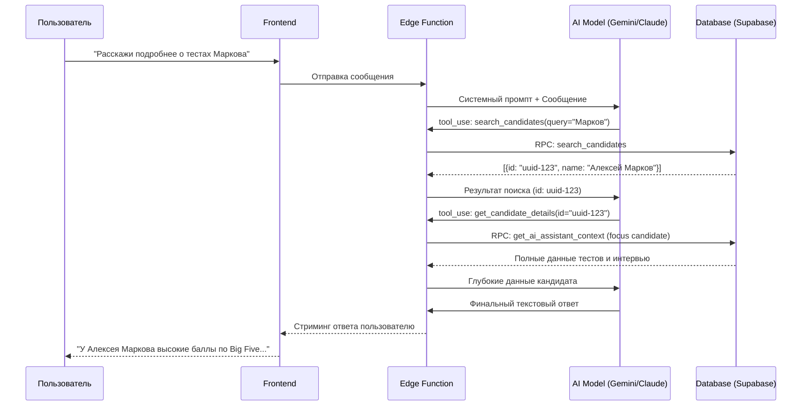

# Техническое задание: Интеграция Инструментов (Function Calling) в AI-Ассистент

## 1. ВВЕДЕНИЕ И ЦЕЛЬ
Текущая архитектура ассистента использует "статичный контекст", который отправляется вместе с каждым сообщением. Это ограничивает ИИ знанием только о последних 20 кандидатах и создает избыточную нагрузку на токены.

**Цель:** Перейти на архитектуру инструментов (Function Calling), позволяющую ИИ самостоятельно запрашивать необходимые данные из базы данных в реальном времени.

---

## 2. АРХИТЕКТУРА "УМНОГО КОНТЕКСТА"

### 2.1 Список инструментов (Tools)

| Инструмент | Параметры | Описание |
| :--- | :--- | :--- |
| `search_candidates` | `query` (string) | Поиск кандидата по имени или навыкам во всей базе организации. |
| `get_candidate_details` | `id` (uuid) | Получение полного профиля: опыт, образование, результаты ВСЕХ тестов и протоколы интервью. |
| `get_vacancy_details` | `id` (uuid) | Получение полных требований, описания и "идеального профиля" вакансии. |
| `get_org_stats` | - | Получение актуальной статистики воронки найма и баланса токенов. |

### 2.2 Логика работы (Sequence)

---

## 3. ТЕХНИЧЕСКАЯ РЕАЛИЗАЦИЯ

### 3.1 Изменения в Edge Function (`ai-assistant`)
*   **Цикл обработки (Tool Loop):** Функция должна уметь обрабатывать ответы модели типа `tool_use`, выполнять соответствующие запросы к БД и отправлять результат обратно модели до тех пор, пока модель не решит дать финальный ответ.
*   **Поддержка провайдеров:**
    *   **Gemini:** Использование поля `tools` в конфигурации запроса.
    *   **Claude:** Использование API `tools` (Beta).

### 3.2 Изменения в базе данных (Supabase)
Необходимо создать/обновить RPC-функции для точечного поиска:
*   `search_candidates_global(p_org_id, p_query)` — поиск по всей таблице `candidates` для текущей организации.
*   Оптимизация `get_ai_assistant_context` для работы в режиме "только конкретная сущность" без загрузки лишних списков.

---

## 4. ПРЕИМУЩЕСТВА И ЭКОНОМИКА
1.  **Масштабируемость:** ИИ может работать с базой в 10,000+ кандидатов.
2.  **Экономия токенов:** Мы не платим за передачу данных кандидатов, о которых пользователь не спрашивал.
3.  **Точность:** ИИ не "галлюцинирует" на основе старых данных, так как всегда вызывает свежий запрос.

---

## 5. ЭТАПЫ РАБОТЫ (План на следующую сессию)
1.  **DB:** Создание RPC для глобального поиска кандидатов.
2.  **EF:** Подключение библиотек для работы с инструментами в Edge Function.
3.  **EF:** Реализация "движка" Function Calling (обработка цикла запросов).
4.  **Prompt:** Обновление системных инструкций для обучения ИИ пользоваться новыми инструментами.
5.  **Test:** Проверка сценариев: "Найди кандидата X", "Сравни его с вакансией Y", "Дай общую статистику".